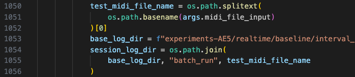

# StreamMUSE Artifact Evaluation Guide

- [Overview](#overview)
- [Artifact #1: StreamMUSE](#artifact-1-streammuse)
- [Artifact #2: Eval Toolkit](#artifact-2-eval-toolkit)
- [Reproducing our Experiments](#reproducing-our-experiments)
  - [Reproducing Table X (Main Results)](#reproducing-table-x-main-results)
    - [Quick Start (Test Workflow)](#quick-start-test-workflow)
      - [Start the Server](#start-the-server)
      - [Run Client to Generate Accompaniment](#run-client-to-generate-accompaniment)
      - [Expected Output Structure](#expected-output-structure)
    - [Reproducing Full Experiments](#reproducing-full-experiments)
      - [Generation Phase](#generation-phase)
        - [Method 1: Manual Run (Single Parameter Set)](#method-1-manual-run-single-parameter-set)
        - [Method 2: Batch Run (Multiple Parameter Sets)](#method-2-batch-run-multiple-parameter-sets)
      - [Evaluation Phase](#evaluation-phase)
        - [1. Compute Musical Quality Metrics](#1-compute-musical-quality-metrics)
        - [2. Compute System Metrics (Latency, Hit Rate, etc.)](#2-compute-system-metrics-latency-hit-rate-etc)
        - [3. Results Aggregation and Analysis](#3-results-aggregation-and-analysis)
      - [Detailed Parameter Reference](#detailed-parameter-reference)
  - [Reproducing Figure X1](#reproducing-figure-x1)
  - [Reproducing Figure X2](#reproducing-figure-x2)

---

## Overview

This guide provides instructions for reproducing the experiments in the StreamMUSE paper. StreamMUSE is a real-time music accompaniment generation system that generates piano accompaniment given a live melody input.

**Workflow Summary:**
1. **Setup**: Clone repositories, download model checkpoint, prepare dataset
2. **Generation**: Start server + run client to generate accompaniments
3. **Evaluation**: Compute musical quality metrics and system performance metrics
4. **Aggregation**: Collect results for analysis

**Hardware Requirements:**
- GPU with CUDA support (tested on NVIDIA A100, RTX A4000)
- 16GB+ GPU memory recommended
- Linux/macOS environment

**Working Directory Convention:**
Unless otherwise specified, all commands should be executed from the root directory (`AE/`). When a command block starts with `cd StreamMUSE` or `cd eval`, execute that command from the root directory, and subsequent commands in that block should be run from the respective subdirectory.

---

## Artifact #1: StreamMUSE

**Source:** https://github.com/StreamMUSE/StreamMUSE

**Description:** Main codebase for real-time accompaniment generation, including:
- FastAPI server for model inference (`app/server.py`)
- Client for real-time interaction (`app/client.py`)
- Batch experiment runner (`real_time_experiment_runner.py`)
- Data preprocessing and extraction tools

**Expected Folder Structure:**
```
AE/
├── StreamMUSE/           # StreamMUSE repository
│   ├── app/              # Server and client code
│   ├── ckpt/             # Model checkpoint directory
│   ├── input/            # Input data (mel/acc)
│   └── ...
└── eval/                 # Eval toolkit (Artifact #2)
```

**Quick Start:**

1. **Clone the repository:**
   ```bash
   git clone https://github.com/StreamMUSE/StreamMUSE.git
   ```

2. **Download model checkpoint:**
   ```bash
   pip install huggingface-hub
   mkdir -p StreamMUSE/ckpt
   hf download Jianshu001/music cp_transformer_909+ac+1k7_trackemb_interleavepos_v0.2_large_batch_40_schedule.epoch=00.val_loss=0.90296.ckpt --local-dir StreamMUSE/ckpt
   ```

   In this example code, the target path is `StreamMUSE/ckpt`, you can replace this with any path you like.

3. **Prepare dataset:**
   ```bash
   # Dataset structure should be:
   <dataset-name>/
   ├── mel/           # Melody MIDI files
   │   ├── 001.mid
   │   └── ...
   └── acc/           # Accompaniment MIDI files (for evaluation)
       ├── 001.mid
       └── ...
   ```

   **Using test dataset inside StreamMUSE**: There is one small dataset inside StreamMUSE (`StreamMUSE/input`), which can be directly used for running. I recommend you use this small dataset first to test if everything works well.

   **Download dataset**: Download from [Hugging Face Datasets](https://huggingface.co/datasets/S-tanley/formatted_dataset/tree/main/test64_top1). This dataset (test64_top1) is the test dataset we are using for the experiments in the paper. **Important**: If you are using this dataset, it will run about 1 h for one combination.


4. **Install dependencies:**
   This project uses uv to manage the environment, according to the [uv official website](https://docs.astral.sh/uv/), download uv.

---

## Artifact #2: Eval Toolkit

**Source:** https://github.com/StreamMUSE/eval

**Description:** Evaluation toolkit for computing musical quality and system performance metrics:
- Musical metrics: JSD (pitch/duration/onset), FMD, PolyDis metrics
- System metrics: hit rate, backup level, latency
- Batch evaluation scripts

**Installation:**
```bash
git clone https://github.com/StreamMUSE/eval.git
```

---

## Reproducing our Experiments

All experiments follow the same pattern:
1. Start the StreamMUSE server
2. Run the specific client with specific parameters
3. Evaluate results using the eval toolkit or other evaluation codes.

---

### Reproducing Table X (Main Results)

This section reproduces the main experimental results table with different generation intervals and frame sizes.

#### Quick Start (Test Workflow)

##### Start the Server

```bash
cd StreamMUSE

# Set environment variables
export CUDA_VISIBLE_DEVICES=1  # Specify GPU (needed in multi-GPU environments)
export CHECKPOINT_PATH=<your-model-path>
export MODEL_MAX_SEQ_LEN_FRAMES=384  # Model window length (frames)

# Start FastAPI server
PYTHONPATH="$(pwd)" uv run -- uvicorn app.server:app --host 0.0.0.0 --port 8988
```

**Parameter Description:**
- `CUDA_VISIBLE_DEVICES`: Only needed when you have multiple GPUs
- `CHECKPOINT_PATH`: Model checkpoint path (be careful with escaping spaces)
- `MODEL_MAX_SEQ_LEN_FRAMES`: Context window length

##### Run Client to Generate Accompaniment

```bash
cd StreamMUSE

uv run real_time_experiment_runner.py \
    --dataset-dir input/mel \
    --injection-length 128 \
    --generation-length 576 \
    --out-root <your-desired-output-name>/realtime/baseline/interval_2_gen_frame_5/prompt_128_gen_576/batch_run \
    --server-url http://localhost:8988/generate_accompaniment \
    --generation-interval-ticks 2 \
    --generation-length-per-request 5
```

> **Note**: To ensure files are generated in the correct location, you need to modify a parameter in `StreamMUSE/app/client.py`:
> At line 1053, change the beginning filename in `base_log_dir` to match `<your-desired-output-name>` outside.
> 
> As shown in the figure, change `experiments-AE5` to `<your-desired-output-name>`.

> **Note**: The output directory naming needs to match your chosen parameters, with the format:
> `interval_<generation-interval>_gen_frame_<frames-per-request>/prompt_<injection-length>_gen_<total-generation-length>/`
>
> For example, if you use `--generation-interval-ticks 2 --generation-length-per-request 5 --injection-length 128 --generation-length 576`,
> then the path should be `interval_2_gen_frame_5/prompt_128_gen_576/`

##### Expected Output Structure

```
<your-desired-output-name>/realtime/baseline/interval_2_gen_frame_5/prompt_128_gen_576/
├── batch_run/                    # Log files directory
│   ├── 001/                      # One directory per song
│   │   ├── inferences.json       # Complete JSON logs of inference requests/responses
│   │   └── tick_history.json     # Hit/miss/backup records per tick
│   ├── 002/
│   └── ...
├── generated/                    # Generated MIDI files directory
│   ├── 001.mid                   # Generated accompaniment MIDI file
│   ├── 002.mid
│   └── ...
└── gt_generation/                # Ground truth directory (for evaluation comparison)
    ├── 001.mid                   # Real accompaniment MIDI file
    ├── 002.mid
    └── ...
```

---

#### Reproducing Full Experiments

##### Generation Phase

###### Method 1: Manual Run (Single Parameter Set)

```bash
# Terminal 1: Start server
cd StreamMUSE
export CHECKPOINT_PATH=~/ugrip/models/ModelBaseline/cp_transformer_909+ac+1k7_trackemb_interleavepos_v0.2_large_batch_40_schedule.epoch\=00.val_loss\=0.90296.ckpt
export MODEL_MAX_SEQ_LEN_FRAMES=384
PYTHONPATH="$(pwd)" uv run -- uvicorn app.server:app --host 0.0.0.0 --port 8988

# Terminal 2: Run client
cd StreamMUSE
uv run real_time_experiment_runner.py --dataset-dir input/mel --injection-length 128 --generation-length 576 --out-root experiments-AE5/realtime/baseline/interval_1_gen_frame_3/prompt_128_gen_576/batch_run --server-url http://localhost:8988/generate_accompaniment --generation-interval-ticks 1 --generation-length-per-request 3
```

###### Method 2: Batch Run (Multiple Parameter Sets)

Use the pre-configured `test-run.sh`:
```bash
cd StreamMUSE
# start server like previous do first, same code as before, I just omit here

chmod +x test-run.sh
./test-run.sh
```

Example content of `test-run.sh` (can be modified as needed):
```bash
#!/usr/bin/env bash
# Run multiple parameter combinations
python3 real_time_experiment_runner.py --dataset-dir input/mel --injection-length 128 --generation-length 576 --out-root experiments-AE5/realtime/baseline/interval_1_gen_frame_3/prompt_128_gen_576/batch_run --server-url http://localhost:8988/generate_accompaniment --generation-interval-ticks 1 --generation-length-per-request 3
python3 real_time_experiment_runner.py --dataset-dir input/mel --injection-length 128 --generation-length 576 --out-root experiments-AE5/realtime/baseline/interval_2_gen_frame_5/prompt_128_gen_576/batch_run --server-url http://localhost:8988/generate_accompaniment --generation-interval-ticks 2 --generation-length-per-request 5
# ... more combinations
```

##### Evaluation Phase

###### 1. Compute Musical Quality Metrics

**Single Evaluation (Detailed Output):**
```bash
cd eval

uv run evaluate_accompaniment_metrics.py \
    --generated-dir <your-experiment-folder-path>/realtime/baseline/interval_2_gen_frame_5/prompt_128_gen_384/generated \
    --groundtruth-dir <your-experiment-folder-path>/realtime/baseline/interval_2_gen_frame_5/prompt_128_gen_384/gt-generation \
    --output-json results/interval2_gen5_metrics.json \
    --melody-track-names Guitar \
    --auto-phrase-analysis
```
`generated-dir`, `groundtruth-dir` and `output-json` need to be alter to your corresponding path.

**Batch Evaluation (Recommended):**
```bash
cd eval
./batch_evaluate_stanley.sh
```

Edit `batch_evaluate_stanley.sh` configuration (adjust according to experimental needs):
```bash
# List of interval values to iterate
INTERVALS=(1 2 4 7)

# List of generation frame values to iterate
GEN_FRAMES=(3 5 9 15)

# Root directory (adjust according to actual location)
REALTIME_ROOT="<your-experiment-folder-path>/realtime/baseline" # for example, "/home/ubuntu/ugrip/stanleyz/AE/experiments-AE4/realtime/baseline"

```

###### 2. Compute System Metrics (Latency, Hit Rate, etc.)

```bash
cd eval

uv run compute_final_system_metric.py \
    ../StreamMUSE/<your-experiment-folder-path>/realtime/ \
    -o results-<experiment-results-folder>/final-sys-results
```

**Output File Structure:**
```
results-<experiment-results-folder>/final-sys-results/
├── interval_1_gen_frame_3.json
├── interval_2_gen_frame_5.json
└── ...
```

Each JSON file contains:
- `global_hit_rate`: Global hit rate
- `global_avg_backup`: Average backup time
- `ISR_w`: Weighted interrupt service rate
- Other system performance metrics

###### 3. Results Aggregation and Analysis

**Aggregate Musical Quality Metrics:**
```bash
cd eval

# Create summary table
uv run summarize_metrics.py results-<experiment-results-folder>/
```

**Add NLL and Generate Final Table:**
```bash
cd eval

# Add NLL (negative log-likelihood) to the summary table
uv run add_nll_to_summary.py results-<experiment-results-folder>/ -o final_experiment_results.csv
```

**Final Output:**
- `final_experiment_results.csv`: Musical quality metrics and system metrics for all experimental configurations
- `results-experiments2/final-sys-results/`: System metrics JSON files

##### Detailed Parameter Reference

**Server Parameters (app.server)**

| Parameter | Description | Example |
|-----------|-------------|---------|
| `CUDA_VISIBLE_DEVICES` | Specify GPU device | `0`, `1`, `0,1` |
| `CHECKPOINT_PATH` | Model checkpoint path | `~/ugrip/models/ModelBaseline/model.ckpt` |
| `MODEL_MAX_SEQ_LEN_FRAMES` | Maximum sequence length | `384`, `576` |
| Port | Server listening port | `8988` |

**Client Parameters (real_time_experiment_runner.py)**

| Parameter | Description | Example |
|-----------|-------------|---------|
| `--dataset-dir` | Input melody directory | `input/mel` |
| `--injection-length` | Prompt length (frames) | `128`, `256` |
| `--generation-length` | Total generation length (frames) | `384`, `576` |
| `--out-root` | Output root directory | `experiments-AE2/realtime/baseline/...` |
| `--server-url` | Server endpoint | `http://localhost:8988/generate_accompaniment` |
| `--generation-interval-ticks` | Generation interval | `1`, `2`, `4`, `7` |
| `--generation-length-per-request` | Length per request | `3`, `5`, `9`, `15` |

**Evaluation Parameters (evaluate_accompaniment_metrics.py)**

| Parameter | Description | Default |
|-----------|-------------|---------|
| `--generated-dir` | Generated files directory | (required) |
| `--groundtruth-dir` | Ground truth directory | (required) |
| `--melody-track-names` | Melody track name | `Guitar` |
| `--auto-phrase-analysis` | Enable phrase analysis | disabled |
| `--frechet-music-distance` | Enable FMD | disabled |
| `--polydis-root` | PolyDis path | (none) |
| `--output-json` | Output JSON file | (optional) |

---

### Reproducing Figure X1

placeholder: if you see the this, do not edit this section

---

### Reproducing Figure X2

placeholder: if you see the this, do not edit this section

